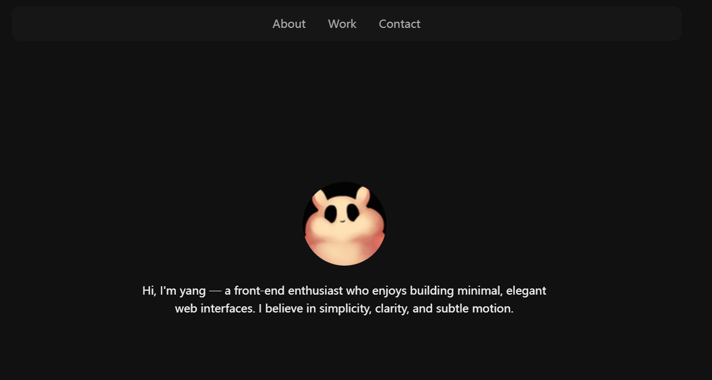

# Personal Portfolio Site

A minimal and elegant personal website built with HTML and CSS — inspired by the aesthetic simplicity and smooth transitions of [Lokkee Studios](https://lokkeestudios.com).

This project showcases my approach to clear structure, subtle motion, and clean typography.

---

## ✨ Features

- **About Section**: A short self-introduction with a profile image.
- **Work Section**: Selected projects with descriptions and links to source code.
- **Smooth Scroll**: Seamless page transitions with `scroll-snap` for a full-screen slide-like experience.
- **Fade-in Animation**: Elegant "slide up & fade" effect for each section using pure CSS keyframes.
- **Minimalist Style**: Dark-gray backgrounds, soft off-white text, and subtle hover effects for visual clarity.

---

## 📸 Preview




---

## 🛠 Tech Stack

- **HTML5**: Semantic structure
- **CSS3**: Layout, animation, scroll snap, and custom scrollbar
- **No frameworks**, no JavaScript (except optional intersection animation)

---

## 🚀 Getting Started

To view the site locally:

```bash
git clone https://github.com/yourname/your-repo-name.git
cd your-repo-name
open index.html
